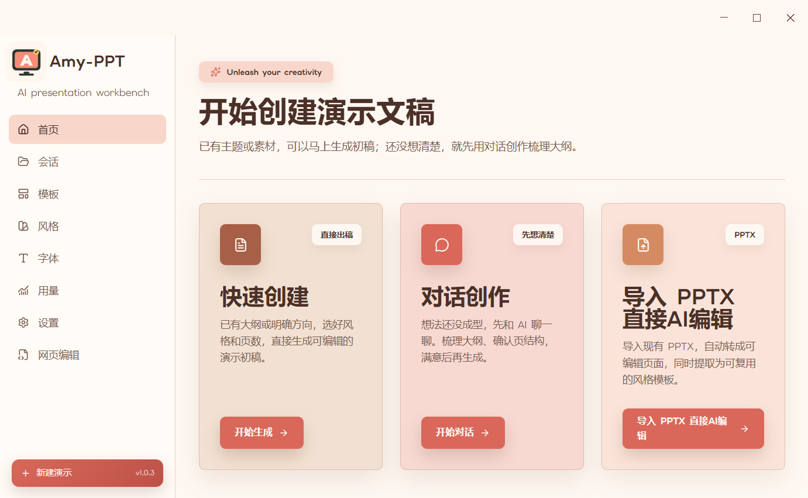
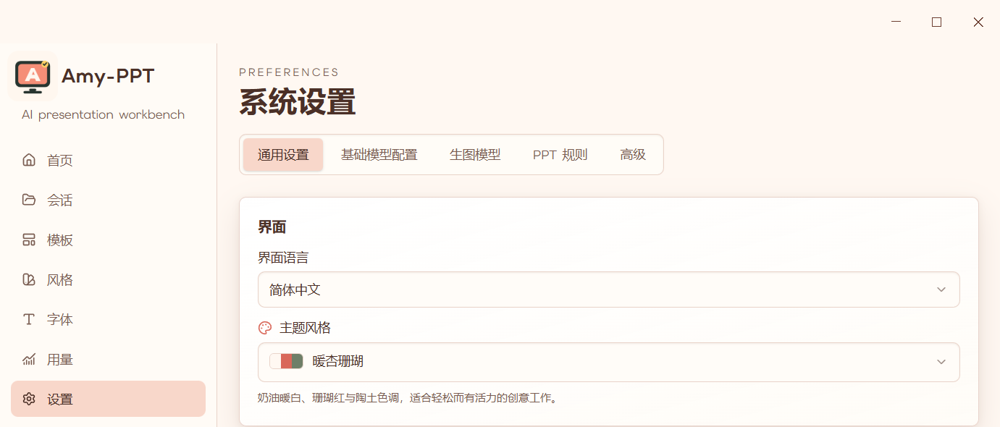
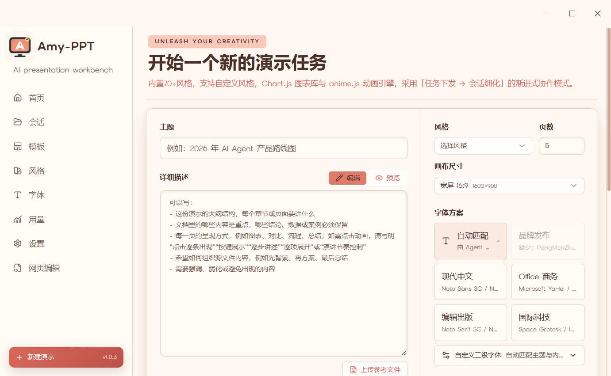

# Amy-PPT 快速使用指南

本文面向第一次使用 Amy-PPT 的用户，目标是用最短流程完成模型配置、创建演示文稿、检查结果并导出文件。

## 1. 打开软件

启动 Amy-PPT 后，首页提供三种主要入口：

- **快速创建**：已经有明确主题或大纲，直接生成演示文稿。
- **对话创作**：先与 AI 梳理需求和结构，再进入生成流程。
- **导入 PPTX 直接 AI 编辑**：把已有 PPTX 转为可编辑页面后继续修改。

第一次使用建议选择 **快速创建**。

## 2. 完成首次设置

在左侧导航栏打开 **设置**。

1. 在 **通用设置** 中选择界面语言、主题风格和演示文稿存储路径。
2. 在 **基础模型配置** 中添加文本模型，并将可用配置设为默认模型。
3. 只有需要 AI 配图时，才在 **生图模型** 中配置图片生成模型。

文本模型支持 OpenAI 兼容 Chat Completions、OpenAI Responses、Anthropic、Google Gemini 和智谱兼容接口。模型名称、接口地址和 API Key 应以对应 Provider 的说明为准。

> API Key 保存在本机。不要在截图、日志、数据库或提交记录中公开真实密钥。

## 3. 新建演示文稿

回到首页，点击 **快速创建 → 开始生成**。在创建页完成以下内容：

1. 输入主题，例如“2026 年 AI Agent 产品路线图”。
2. 在详细描述中补充目标受众、章节结构、必须保留的数据和不希望出现的内容。
3. 选择风格、页数和画布尺寸。
4. 选择字体方案。
5. 选择插图方式：
   - **图片占位符**：不调用生图模型，适合先完成版式和内容。
   - **AI 生成配图**：仅为需要图片的版式生成配图，必须先配置生图模型。
6. 按需上传 Markdown、TXT、CSV、DOCX 或图片作为参考资料。

## 4. 开始生成

填写主题并选择风格后，滚动到页面底部，点击 **创建会话并开始**。

生成过程会建立会话、规划大纲并逐页生成内容。可以离开生成页；任务仍会保留在 **会话** 中。生成耗时取决于页数、模型速度、参考资料大小以及是否启用 AI 配图。

## 5. 检查和编辑

生成完成后，在 **会话** 中打开演示文稿。建议按以下顺序检查：

1. 先检查目录、页面顺序和结论是否完整。
2. 再检查数据、引用、图片和字体是否正确。
3. 使用整页编辑调整单页内容或版式。
4. 使用 deck 编辑处理跨页统一修改。
5. 需要精确修改时，进入元素级编辑或网页编辑。

重要演示文稿应人工复核事实、数字、引用和版权素材，不能只依赖自动检查。

## 6. 导出结果

在会话详情页点击 **导出**，按用途选择格式：

- **可编辑 PPTX**：尽量保留文字、形状、图片和表格的可编辑性，导出后应检查字体替换和版式细节。
- **纯图 PPTX**：以页面图片保证视觉还原，内容不可逐元素编辑。
- **PDF / PNG / 长图**：适合审阅、分享和发布。
- **slide-pack / 会话 ZIP**：适合备份、迁移和继续编辑。
- **Markdown 大纲**：导出内容结构。

MP4 只有在当前安装包包含可用 ffmpeg 时才会启用；按钮显示不可用时，请改用其他导出格式。

## 常见问题

### “创建会话并开始”按钮不可点击

确认已经填写主题并选择风格。若选择 AI 生成配图，还需要先配置并启用生图模型。

### 模型请求失败

依次检查 Provider 类型、接口地址、模型名称、API Key、网络连接和账户额度。OpenAI 兼容服务应确认其实际支持 Chat Completions 还是 Responses 协议。

### PPTX 导入后部分内容发生变化

复杂表格、部分图表、视频、音频和特殊 PowerPoint 效果可能降级。导入后应逐页检查，再进行 AI 编辑。

### PPTX 导出后字体或位置变化

优先安装演示所用字体，或选择纯图 PPTX/PDF 保证视觉一致性。可编辑 PPTX 导出完成后必须在 PowerPoint 中快速复核。
