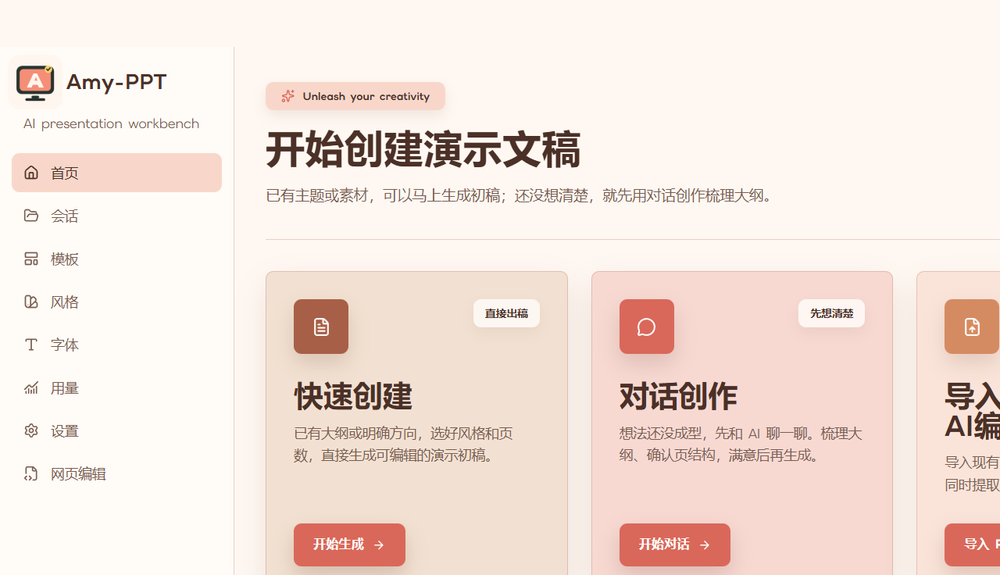

<div align="center">
  

# Amy-PPT

**An agent-controlled, reviewable, and editable AI presentation studio**

[中文](./README.md) · [Changelog](./CHANGELOG.md) · [Issues](https://github.com/296711867/Amy-PPT/issues) · [Releases](https://github.com/296711867/Amy-PPT/releases)

</div>

Amy-PPT is an Electron desktop presentation workbench. Instead of asking a model to emit a collection of web pages in one pass, it runs a controlled workflow for planning, page generation, validated persistence, rollback, deck-level visual review, and narrative review.



## Highlights

- Agent-driven deck creation from a topic, detailed brief, or source document.
- Editable Layout Rules and an expert Markdown editor for canvas, typography, safe areas, spacing, cards, and narrative structure.
- A universal layout library for 1-6 text sections, mixed image/text compositions, and 2/3/4/6-image galleries, with adjacent-slide silhouette rotation.
- HTML and rendered-page harnesses for structure, typography, clipping, overflow, overlap, canvas, and font contracts.
- Deck-level review for palette, titles, margins, density, layout rhythm, and web-dashboard patterns.
- Narrative review for process leakage, repetition, slide responsibilities, evidence interpretation, openings, and conclusions.
- Document-to-PPT support for Markdown, TXT, CSV, DOCX, and image references with page-scoped retrieval.
- Visual, full-page, deck, and selector-scoped editing with differential validation and rollback.
- PPTX import, HTML presentation, editable PPTX export, templates, styles, fonts, and media workflows.
- Local-first storage with user-configured model providers.
- Extensible application themes, including Warm Apricot Coral and Pastel.

## Development

Requires Node.js 20+ and pnpm 10.

```bash
pnpm install
pnpm dev
```

Run focused verification with:

```bash
pnpm run typecheck:node
pnpm run typecheck:web
pnpm test -- tests/unit/path/to/test.test.ts
```

## Updates

Amy-PPT 1.0.0 uses its own update manifest at:

```text
https://raw.githubusercontent.com/296711867/Amy-PPT/main/version.json
```

Override it for private or self-hosted releases with `AMY_PPT_UPDATE_MANIFEST_URL`.

## License

Amy-PPT is a derivative work distributed under the Apache License 2.0. Original attribution is retained in [LICENSE](./LICENSE) and [NOTICE](./NOTICE).
